# Hi, I'm Suganth

Full stack developer focused on practical web apps, AI-powered tools, and software that feels polished, useful, and easy to maintain.

  
  
  

<table>
<tr>
<td width="34%" valign="top">

<strong>Suganth</strong> 
Suganth1795 
Full Stack Developer 
India

</td>
<td width="66%" valign="top">

## About Me

- Full Stack Developer
- B.Tech in Computer Science & Business Systems
- Interested in AI, web development, and software engineering
- Building projects with Java, Python, JavaScript, TypeScript, and SQL

## Currently Building

- AI-driven applications
- Full stack web experiences
- Portfolio and product projects
- Stronger foundations in data structures and algorithms

</td>
</tr>
</table>

<table>
<tr>
<td align="center" width="40%">

</td>
<td align="center" width="60%">

</td>
</tr>
</table>

## Skills

| Languages | Frontend | Backend |
| --- | --- | --- |
| Java Python JavaScript TypeScript SQL C++ | HTML5 CSS3 React.js Next.js Tailwind CSS | Node.js Express.js MongoDB REST APIs |

## Featured Projects

| Project | Description |
| --- | --- |
| MindGuardian AI | AI-powered mental wellness platform |
| IndustrialMart | Industrial machinery marketplace |
| Personal Portfolio | Responsive portfolio built with React and Next.js |
| AI Utilities | Experiments and automation around generative AI |

## GitHub Stats

  
  

## Contribution Activity

## Connect With Me

- GitHub: [Suganth1795](https://github.com/Suganth1795)
- LinkedIn: [Suganth](https://linkedin.com/in/suganth1795/)
- Portfolio: [Live site](https://suganthportfolio.vercel.app)

Thanks for visiting my profile. Feel free to explore my repositories and connect with me.

