<div align="center">

# Hi, I'm Suganth CL

Full stack developer focused on practical web apps, AI-powered tools, and software that feels polished, useful, and easy to maintain.

<p>
  
  
  
  
</p>

<p>
  <a href="https://github.com/Suganth1795">
    
  </a>
  <a href="https://linkedin.com/in/suganth1795/">
    
  </a>
  <a href="https://suganthportfolio.vercel.app">
    
  </a>
</p>

</div>

## GitHub Stats

<p align="center">
  
  
</p>

<table>
<tr>
<td width="34%" valign="top">

<p align="center">

</p>

<p align="center">
<strong>SUGANTH</strong><br>
Full Stack Developer<br>
India
</p>

</td>
<td width="66%" valign="top">

## About Me

- Full Stack Developer
- B.Tech in Computer Science & Business Systems
- Interested in AI, web development, and software engineering
- Building projects with Java, Python, JavaScript, TypeScript, and SQL

## Currently Building

- AI-driven applications
- Full stack web experiences
- Portfolio and product projects
- Stronger foundations in data structures and algorithms

## Current Git Status

```bash
$ git status
On branch main
nothing to commit, working tree clean
```

</td>
</tr>
</table>

<div align="center">

<table>
<tr>
<td align="center" width="40%">

</td>
<td align="center" width="60%">

</td>
</tr>
</table>

</div>

## Technical Skills

<p align="center">
  
  
  
  
  
  
</p>

<p align="center">
  
  
  
  
  
  
  
  
  
</p>

## Featured Projects

| Project            | Description                                                         |
| ------------------ | ------------------------------------------------------------------- |
| AI Resume Builder  | AI-powered resume builder that helps create tailored resumes faster |
| MindGuardian AI    | AI-powered mental wellness platform                                 |
| IndustrialMart     | Industrial machinery marketplace                                    |
| Personal Portfolio | Responsive portfolio built with React and Next.js                   |
| AI Utilities       | Experiments and automation around generative AI                     |

## GitHub Streak

<p align="center">

</p>

## Connect With Me

- GitHub: [Suganth1795](https://github.com/Suganth1795)
- LinkedIn: [CLS](https://linkedin.com/in/suganth1795/)
- Portfolio: [Live site](https://suganthportfolio.vercel.app)

<div align="center">

Thanks for visiting my profile. Feel free to explore my repositories and connect with me.

</div>
